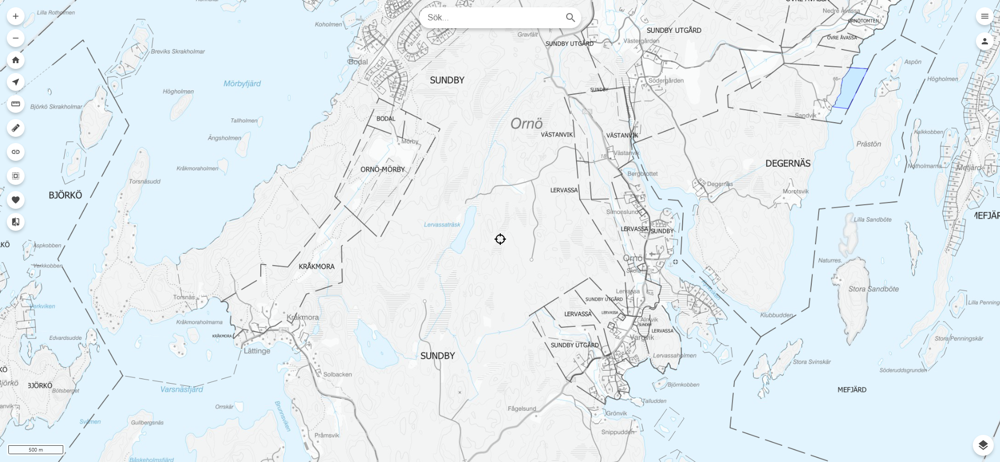
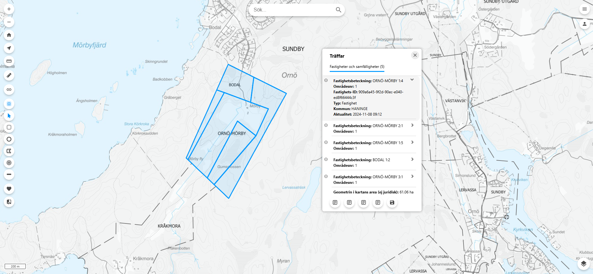

# EDP Vision plugin
A plugin to connect [Origo-map](https://github.com/origo-map/origo) with EDP Visions "Integrations API GIS-koppling (Kubb)"

### Example index.html
```
<body>
	<div id="app-wrapper"></div>
	<script src="js/origo.js"></script>
	<script src="plugins/edp-vision-plugin/edp_vision.min.js"></script>
	<script type="text/javascript">
	//Init origo
	var origo = Origo('index.json');
	origo.on('load', function (viewer) {
		EdpVision({
			user: '', // Default is sessionStorage.getItem('oidc_user')).displayname
			organisation: '',
			clientName: '',
			path: '',
			serverAddress: '',
			realEstateLayer: {
				layerName: '',
				attributes: {
					objectId: '',
					realEstateName: '',
					municipality: ''
				}
			}
		});
	});
	</script>
</body>
```
Get coordinates with the cross hair tool 


Get several realestates with the multiselect tool

